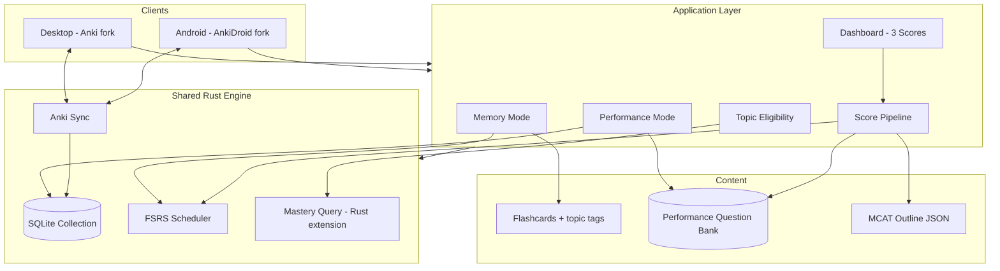
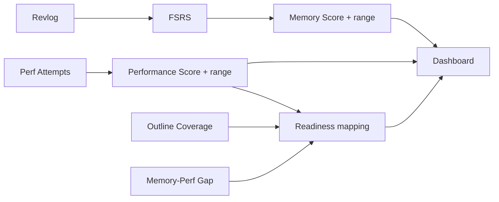

# Architecture — MCAT Speedrun Study App

**Exam:** MCAT | **Engine:** Anki Rust (fork) | **Mobile:** AnkiDroid (Android)

---

## 1. System overview



---

## 2. Design thesis

- **Two modes, three scores, one loop**  
- **Separate measurement** (memory ≠ performance ≠ readiness)  
- **Connected workflow** (eligibility, error typing, next action)  
- **Not a full course** — subset of topics; full outline for coverage denominator  

---

## 3. Components

### 3.1 Desktop (Anki fork)

| Layer | Technology | Responsibility |
|-------|------------|----------------|
| UI | Python / Qt | Memory mode, performance mode, dashboard |
| Bridge | PyO3 / protobuf | Call Rust mastery query |
| Collection | SQLite | Cards, revlog, notes, decks |
| Perf sidecar | SQLite (`mcat_perf.db`) | Performance questions/attempts — kept out of the synced collection |

### 3.2 Android (AnkiDroid fork)

| Capability | v1 priority |
|------------|-------------|
| Memory reviews | Required |
| Anki sync | Required |
| Three scores + give-up | Required |
| Performance UI | Optional / slim |
| Offline | Required |

### 3.3 Rust engine

| Module | Role |
|--------|------|
| Anki core | Collection, FSRS, sync, undo |
| **Mastery query** (custom) | Per-topic stats for eligibility + dashboard |
| FSRS | Memory score input |

**Rejected for v1:** full topic-aware reschedule rewrite (undo risk); points-at-stake queue (can follow mastery query).

---

## 4. Data model

### 4.1 Topic outline

```json
{
  "sections": [
    {
      "id": "BB",
      "name": "Biological and Biochemical Foundations",
      "topics": [
        { "id": "bb_glycolysis", "name": "Glycolysis", "weight": 1.0 }
      ]
    }
  ]
}
```

### 4.2 Flashcards

Standard Anki notes/cards with tags: `topic:bb_glycolysis`

### 4.3 Performance questions

Stored in the `perf_questions` table of the sidecar DB (`collection.mcat_perf.db`), loaded from `data/questions.json` at startup.

```json
{
  "id": "q_001",
  "stem": "...",
  "choices": ["A", "B", "C", "D"],
  "correct": "B",
  "topic_id": "bb_glycolysis",
  "section": "BB",
  "skill": "2",
  "source_name": "OpenStax Biology 2e",
  "source_url": "https://openstax.org/...",
  "source_location": "Ch 7 Review Q 12",
  "split": "dev"
}
```

### 4.4 Performance attempts

```json
{
  "question_id": "q_041",
  "correct": false,
  "error_type": "passage_mapping",
  "time_seconds": 87,
  "session_id": "...",
  "interleaved": true,
  "timestamp": "..."
}
```

### 4.5 Topic eligibility (computed)

```
performance_unlocked(topic) :=
  distinct_cards_reviewed >= 3
  AND good_or_easy_count >= 5
```

CARS: always unlocked for performance items.

---

## 5. Score pipeline



| Score | Input | Abstain example |
|-------|-------|-----------------|
| Memory | FSRS + calibration | &lt; 200 reviews |
| Performance | Attempt accuracy | &lt; 30 attempts |
| Readiness | Section map + coverage | coverage &lt; 50% |

---

## 6. User flows

### Memory session

1. Load due cards (FSRS)  
2. Grade → revlog  
3. Update mastery query cache  
4. Recompute memory score + eligibility  

### Performance session

1. Filter questions: unlocked topics (+ CARS)  
2. Order: interleaved or blocked (feature flag)  
3. User answers → log attempt  
4. On miss → **re-check probe** (objective content oracle) → **confirm the hypothesis** (error type)  
5. Recompute performance score + readiness + next action  

**Rule:** never immediately after revealing the matching flashcard.

---

## 7. Sync architecture

Two independent channels (see [`DECISIONS.md` §22](DECISIONS.md)) — memory data rides stock Anki sync; performance data syncs via a separate custom bundle.

**(a) Memory data — stock Anki Rust sync**

- **Scope:** the standard collection only — cards, revlog, notes, decks  
- **Revlog conflicts:** document rule (e.g. union revlogs → recompute FSRS); `cards` scheduling state is last-writer-wins by `mtime`  

**(b) Performance data — separate sidecar + custom bundle**

- **Storage:** sidecar `collection.mcat_perf.db`, deliberately kept **out** of the synced collection so a stock full sync can't silently wipe unknown custom tables (see §5)  
- **Protocol:** custom versioned JSON export/import bundle (`format: "mcat_perf_bundle"`, `format_version: 1`) — **not** stock Anki sync  
- **Attempts:** append-only — no merge conflicts; UNION-merged and deduped by a stable per-attempt `uuid` (idempotent + order-independent → both devices converge)  

**Acceptance (7b):** 10 phone + 10 desktop offline reviews; same-card dual offline review.

---

## 8. Error typing → next action

| Type | Dashboard next action |
|------|---------------------|
| `content_gap` | Memory cards in topic |
| `passage_mapping` | Passage drills in topic |
| `reasoning` | Hard Skill 2–4 interleaved set |
| `misread` | Timed retry set |

**Miss flow — probe + confirm the hypothesis (v2):** a miss does not ask for a
blind self-report, nor silently auto-label. It runs a **re-check probe** (recall
oracle for whether the content was held), then surfaces a **specific,
evidence-backed hypothesis** the student **confirms or overrides** in one tap.
The probe measures the objective content axis; the confirm captures the only
un-inferable axis (careless *misread* vs. genuine *application* error) as a
correctable hypothesis, not a verdict — so the next-action routing above lands on
the right fix. Full rationale in [`DECISIONS.md` §9](DECISIONS.md); mechanism in
[`ERROR-DIAGNOSIS-SPEC.md`](ERROR-DIAGNOSIS-SPEC.md).

---

## 9. Study feature hook

```python
PerformanceSessionConfig(
    interleave: bool,      # True = study feature ON
    topic_filter: list,
    time_limit_minutes: int,
)
```

Three builds: interleave ON / OFF / plain Anki.

---

## 10. Eval architecture

| Target | Command |
|--------|---------|
| Latency | `make bench` |
| Memory calibration | `make eval-memory` |
| Performance + paraphrase gap | `make eval-performance` |
| Leakage | `make eval-leakage` |
| AI (optional) | `make eval-ai` |

Splits:

- Reviews: time-based train/test  
- Questions: frozen `held_out` IDs  
- Friend: answers held-out once  

---

## 11. Platform split

| Feature | Desktop | Android |
|---------|---------|---------|
| Memory mode | ✓ | ✓ |
| Performance mode | ✓ full | optional |
| Dashboard | ✓ full | ✓ summary |
| Eval scripts | ✓ | — |
| Installer | ✓ | APK |

---

## 12. Build dependency order

```
1. Anki builds
2. Mastery query in Rust
3. Topic tags + outline JSON
4. Memory mode + memory score
5. Question bank loader + performance mode
6. Dashboard (3 scores)
7. AnkiDroid fork + sync
8. Eval scripts + packaging
```

---

## 13. Security / licensing

- AGPL-3.0-or-later for fork; attribute Anki / AnkiDroid  
- No proprietary QBank scraping  
- AI outputs must cite source chunks  

See [`DECISIONS.md`](DECISIONS.md) for locked choices.
