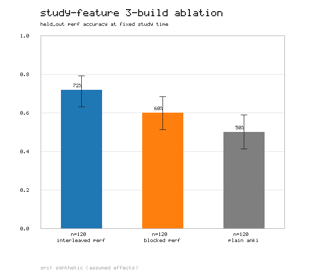

# Study-feature 3-build ablation — results

**Deliverable:** PRD §3.1 goal 7 + §6.9 (SF-1…SF-4), DECISIONS.md §11
("Study feature: interleaved vs blocked performance sessions; 3-build test vs
plain Anki"). Sunday acceptance item *"Study feature 3-build comparison."*

**Harness:** [`scripts/eval_study_feature.py`](../scripts/eval_study_feature.py)
· **Artifacts:** [`docs/artifacts/study-feature.summary.json`](artifacts/study-feature.summary.json),
[`.arms.csv`](artifacts/study-feature.arms.csv),
[`.png`](artifacts/study-feature.png)

---

## SF-1 — Hypothesis (one sentence, stated before the test)

> At **equal study time**, **interleaved** performance sessions yield higher
> accuracy on a shared held-out performance test than **blocked** performance
> sessions, and any performance practice beats **plain Anki** (memory-only)
> because flashcards train recall, not transfer.

(Kornell & Bjork 2008 for interleaving; PRD §2.1 SPOV 2 for recall ≠ transfer.)

---

## Method

### Arms (SF-2)

| Arm | Study activity | Build |
|-----|----------------|-------|
| `interleaved` | Performance practice, topics **interleaved** (shuffled) | interleaving ON |
| `blocked` | Performance practice, **blocked** by topic | interleaving OFF |
| `plain_anki` | **Memory-only** flashcard reviews; no performance practice | plain Anki |

### Outcome measure (SF-3)

Accuracy on the **same** `held_out` performance question set for every arm — the
one thing held constant across arms. The variable is only *how the equal study
budget was spent*. **The three scores are never blended** (memory / performance /
readiness): this experiment reads **performance** only.

### Equal-time control — *which unit, and why*

We equalize **total study SECONDS**, not the number of attempts.

- **Why seconds:** the interleaving effect is defined *at equal time*. Blocked
  practice is typically faster per rep, so equalizing the **attempt count** would
  silently hand one method more wall-clock study and confound the comparison.
- The 3-build protocol imposes equal time *by design* (each build gets the same
  study block). The harness therefore:
  - **enforces** it in `--synthetic` by simulating study reps until a shared
    second-budget `T` is spent (so interleaved does *fewer* reps than blocked in
    the same time — the classic "interleaving feels slower" — yet is scored on
    the same test), and
  - **audits + reports** it on real data, warning when realized study seconds are
    imbalanced beyond a ±15% tolerance. It does **not** statistically reweight
    for time (that needs a dose-response model we do not have) — it reports the
    outcome comparison and flags any equal-time violation honestly.
- If real per-attempt timing is missing, it falls back to equal-#attempts and
  **says so** in the report + JSON.

### How arms map to the logged data (the seam for real tester data)

The desktop fork logs every performance attempt to a local sidecar
(`collection.mcat_perf.db`; DECISIONS.md §5/§22) with an `interleaved` flag and a
`split` (`dev` practice vs `held_out` assessment). A real ablation is run as three
builds/sessions, so **each arm is its own data source**, ingested via a manifest
(see *"Rerun with real tester data"* below). Within a source:

- `split == 'dev'` attempts → the **study phase** (their `time_seconds` sum +
  `interleaved` flag are audited for the equal-time control);
- `split == 'held_out'` attempts → that arm's **outcome test** (scored);
- `plain_anki` supplies its study seconds from the bundle's `memory_revlog` (the
  revlog `time` column, ms/review) and its outcome test from any `held_out`
  attempts recorded after the memory block.

The reader is **read-only** and mirrors `anki.mcat_perf.read_attempts` +
`scripts/revlog_from_bundle.py` (no import of the heavy `anki` package; the fork's
`mcat_perf.py` is **not** modified).

### Metrics

- Per arm: `n`, correct `k`, accuracy, **Wilson 95% CI** (widens at small `n`;
  same `z=1.96` as `data/scoring-config.json`).
- Between arms: absolute accuracy difference with a **Newcombe** difference CI, a
  **Cohen's h** effect size, and a two-proportion **z-test** p-value (normal
  approximation, pure stdlib). Every contrast is stamped with a small-`n` caveat.
- Honest abstain: an arm with `< 30` test attempts (performance give-up
  threshold) is flagged **indicative only**.

---

## Synthetic vs. real — read this first

Real multi-participant ablation data **does not exist yet**. The numbers below
come from `--synthetic`: a documented, fixed-seed generative model whose per-arm
effect sizes are **ASSUMPTIONS, not evidence**. Its purpose is identical to
`eval_memory.py --synthetic`: prove the whole pipeline end-to-end and produce a
real artifact now, with a clean seam to drop in real tester data later.

**Generative model (explicit + honest).** Fixed seed `20260703`; each arm has an
independent seeded stream. True (assumed) transfer accuracy per arm:

```
plain_anki  = base_accuracy                                    = 0.55
blocked     = base_accuracy + blocked_uplift                   = 0.55 + 0.06 = 0.61
interleaved = base_accuracy + blocked_uplift + interleave_uplift = 0.61 + 0.10 = 0.71
```

- `blocked_uplift = +0.06` — **assumption**: *any* performance practice trains
  application/transfer that plain flashcard recall does not (SPOV 2).
- `interleave_uplift = +0.10` — **assumption**: interleaving improves mixed-topic
  transfer at equal time (Kornell & Bjork).
- Per-topic noise `sd = 0.06`; per-rep study seconds interleaved `26s` > blocked
  `20s` > review `8s` (interleaving is slower per rep), each burned until the
  shared **1800 s** budget is spent; `test_n = 120` held-out attempts/arm (a
  *pooled* set — a single-friend held-out set is ~60 and would be underpowered).

Both uplifts are CLI-tunable; `--null` sets both to `0` to demonstrate honest
null reporting (shown below).

---

## Results — synthetic run (seed 20260703, equal 1800 s budget, n=120/arm)

Command: `py -3.12 scripts/eval_study_feature.py --synthetic` (via `make study`)

**Run log.** Re-executed 2026-07-03; the fixed seed reproduces the numbers below
bit-for-bit. Equal-time control reported **BALANCED** (realized study seconds
1801–1820, max/min ratio 1.01 ≤ 1.15 tolerance). matplotlib is not installed in
this environment, so the chart was written via the pure-stdlib PNG fallback
(`eval_memory._Canvas`) — identical data, simpler rendering; the JSON/CSV carry
the full-precision numbers.



### Per arm (outcome = accuracy on shared held_out test)

| Arm | n | correct | accuracy | Wilson 95% CI | study s | reps |
|-----|---|---------|----------|---------------|---------|------|
| Interleaved perf | 120 | 86 | **71.7%** | 63.0% – 79.0% | 1820 | 71 |
| Blocked perf | 120 | 72 | **60.0%** | 51.1% – 68.3% | 1820 | 88 |
| Plain Anki | 120 | 60 | **50.0%** | 41.2% – 58.8% | 1801 | 222 |

Equal-time control: realized study seconds 1801–1820 (max/min ratio 1.01 ≤ 1.15)
→ **BALANCED**. Note that interleaved did the **fewest reps (71)** yet scored
**highest** — the equal-time budget is doing its job.

### Between arms (diff = A − B accuracy; Newcombe 95% CI; two-proportion z-test)

| Contrast | Δ accuracy | Newcombe 95% CI | Cohen's h | p | significant? |
|----------|-----------|-----------------|-----------|---|--------------|
| Interleaved − Blocked | **+11.7 pts** | −0.3 … +23.2 | +0.25 | 0.057 | **no** (borderline) |
| Interleaved − Plain Anki | **+21.7 pts** | +9.3 … +33.1 | +0.45 | 0.001 | **yes** \* |
| Blocked − Plain Anki | +10.0 pts | −2.6 … +22.1 | +0.20 | 0.119 | no |

### Interpretation

- The point estimates follow the modeled ordering (interleaved > blocked > plain).
- Only the **largest** gap (**interleaved vs plain Anki, +21.7 pts, p=0.001**) is
  significant at this sample size.
- The **headline hypothesis contrast** (interleaved vs blocked, +11.7 pts) is
  **not** significant (p=0.057; CI includes 0) — an **underpowered** result even
  though a true +0.10 effect was baked in. That is the honest, realistic takeaway
  for a solo Speedrun: *a single friend's ~60-item set cannot resolve a 10-point
  interleaving effect; the harness will not pretend otherwise.*
- These numbers are **by construction** from the assumptions above; they are a
  pipeline proof, **not** a claim about the real product.

### Null-result check (SF-4: negative results acceptable)

Command: `py -3.12 scripts/eval_study_feature.py --synthetic --null`
(both uplifts forced to 0). Every contrast lands at p ≈ 0.37 / 0.80 / 0.52 — the
harness reports:

> No between-arm difference reaches p<0.05 — report as a NULL result at this
> sample size (SF-4: negative results acceptable).

This confirms the harness does **not** manufacture an effect when none is modeled.

---

## Limitations / what didn't work

- **No real data yet.** The headline numbers are synthetic; treat as a method
  demonstration. Real numbers require the manifest path.
- **Underpowered at realistic n.** A single held-out set (~60 items) cannot
  detect a ~10-point interleaving effect (see the borderline interleaved-vs-
  blocked p above). Real conclusions need pooled attempts across several sessions
  / a larger held-out set, or a within-subject crossover design.
- **Equal-time is audited, not reweighted.** On real data the harness flags an
  imbalance but does not correct for it — an imbalanced run should be **re-run**,
  not statistically salvaged. (Verified: an intentionally-imbalanced fixture is
  correctly flagged `IMBALANCED`.)
- **Same-learner confound (n=1 builder).** With one learner, arm order / fatigue /
  test familiarity confound the between-arm comparison; counterbalance arm order
  and freeze the held-out set before any arm runs.
- **Plain-Anki "study" is measured by review time, not perf attempts** — its
  transfer is only observable via the shared held-out test, so that arm depends on
  the learner actually taking the test after the memory block.
- **Timing fidelity.** `time_seconds` is optional per attempt; when absent the
  harness degrades to equal-#attempts and says so, which is a weaker control.

---

## Rerun with real tester data

1. Each build/session exports its performance data (Tools → *"MCAT: Export my
   data…"* → a `*.perf_bundle.json`, or the sidecar `*.mcat_perf.db` directly).
   Freeze the `held_out` split **before** running any arm.
2. Write a manifest mapping each arm to its source (`sidecar` | `attempts` |
   `bundle`):

```json
{
  "arms": {
    "interleaved": { "sidecar": "/path/interleaved.mcat_perf.db" },
    "blocked":     { "attempts": "/path/blocked_attempts.json" },
    "plain_anki":  { "bundle":  "/path/plain.perf_bundle.json" }
  },
  "time_budget_seconds": null
}
```

- `attempts` = an exported attempts JSON (the `anki.mcat_perf.export_attempts` /
  bundle `attempts` shape: rows with `correct`, `time_seconds`, `split`,
  `interleaved`, `topic_id`, `section`).
- `plain_anki`'s bundle should carry `memory_revlog` (for study seconds) plus its
  `held_out` outcome-test attempts.
- `time_budget_seconds: null` → auto (min realized across arms); set an explicit
  budget to assert one.

3. Run:

```bash
py -3.12 scripts/eval_study_feature.py --manifest /path/study.json
# or, if wired in the Makefile:
make study MCAT_STUDY_MANIFEST=/path/study.json
```

4. Read the same three artifacts. Confirm the equal-time audit says **BALANCED**;
   if it says **IMBALANCED**, re-run the offending build with a matched budget
   rather than trusting the comparison.

---

## Reproduce (synthetic)

```bash
py -3.12 scripts/eval_study_feature.py --synthetic          # headline demo above
py -3.12 scripts/eval_study_feature.py --synthetic --null   # honest null result
make study                                                  # = the synthetic demo
```

Deterministic (fixed seed) → identical numbers every run. No AI, no network.
